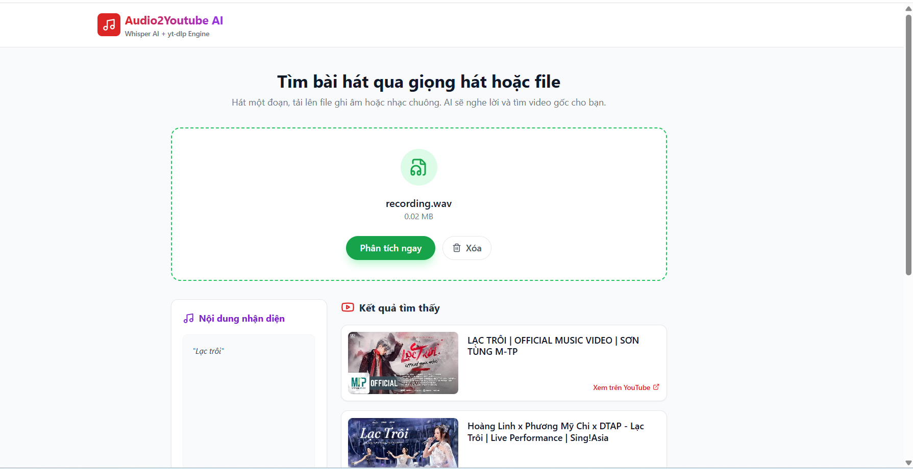
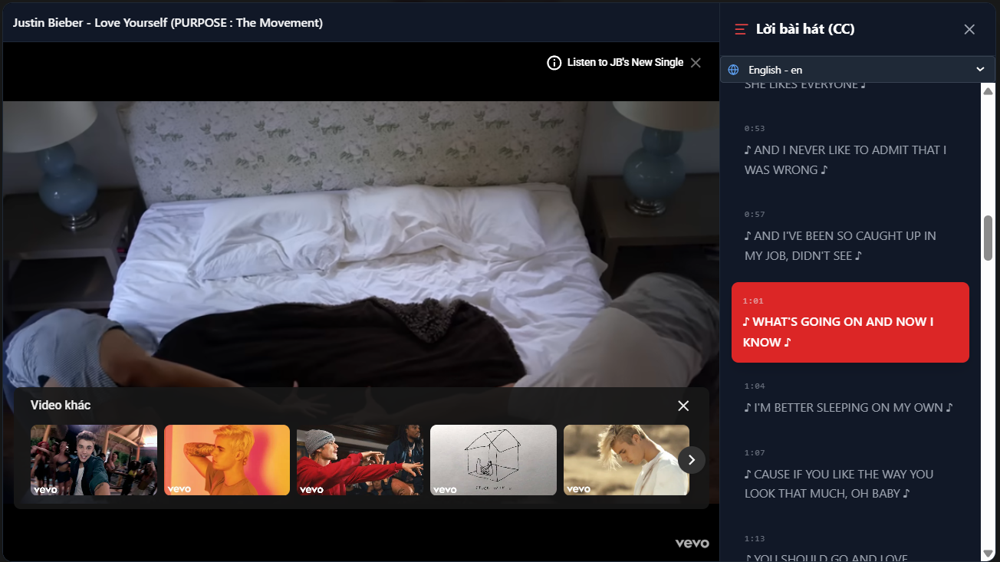

# 🎵 Audio To YouTube AI

Upload audio → **Whisper (Speech-to-Text)** → **Search YouTube (yt-dlp)**

**Audio To YouTube AI** is a full-stack application that allows users to record or upload an audio clip, automatically transcribe it using OpenAI Whisper, and then search YouTube for matching songs or related videos.

The backend is built with **FastAPI**, handling audio processing, WAV conversion, and transcription.  
The frontend is developed using **React + Vite**, providing a simple and interactive interface for recording audio, uploading files, and viewing matched YouTube results.

## Demo

Screenshot of a sample search result (place the image file at `frontend-react/screenshots/result.png` or update the path to your hosted image):



### YouTube preview & transcript

Click the image below to open the video on YouTube. When the video provides captions (transcript/CC) the app will display them in the right-hand panel; you can click a transcript line to jump to that time in the video or edit/replace it if YouTube provides editable captions.

[](https://www.youtube.com)

Image file: [image/preview_youtube.png](image/preview_youtube.png)


## Prerequisites

- Python 3.10+ and `pip`
- Node.js 18+ and `npm` (for frontend)
- `ffmpeg` installed and available in PATH (required for audio conversion)
	- Ubuntu / Debian: `sudo apt update && sudo apt install ffmpeg`
	- Windows: download from https://ffmpeg.org/ and add to PATH

## Backend (API)

1. Open a terminal and go to the backend folder:

```bash
cd backend
```

2. (Optional) Create and activate a virtual environment:

```bash
python -m venv .venv
# Windows
.venv\Scripts\activate
# macOS / Linux
source .venv/bin/activate
```

3. Install Python dependencies:

```bash
pip install -r requirements.txt
```

4. Run the API server (FastAPI / Uvicorn):

```bash
uvicorn main:app --reload
```

The backend will listen on `http://127.0.0.1:8000` by default. The main endpoint used by the frontend is `POST /analyze` (multipart form, field name `file`). The response JSON format is:

```json
{
	"transcript": "detected text",
	"videos": [ { "title": "...", "link": "...", "thumbnail": "...", "channel": "..." }, ... ]
}
```

Uploaded files will be stored under the `uploads/` folder.

## Frontend (React + Vite)

1. Open a new terminal and go to the frontend folder:

```bash
cd frontend-react
```

2. Install dependencies:

```bash
npm install
```

3. Start the dev server:

```bash
npm run dev
```

By default Vite will serve the app on `http://localhost:5173` (the terminal prints the exact URL). The app calls the backend endpoint `/analyze` to upload audio and receive matches. If the backend runs on a different host/port, update the fetch URL or `analyzeAudio` in `src/api.js` accordingly.

## Quick usage

- Start the backend (`uvicorn main:app --reload`).
- Start the frontend (`npm run dev`).
- Open the frontend URL in a browser, allow microphone access when prompted.
- Record a short clip or upload an audio file, then click "Phân tích ngay" to send it to the server.

## Troubleshooting

- If transcription returns empty text, check that `ffmpeg` is installed and the uploaded file is a valid audio file.
- If the frontend can't reach the backend, ensure CORS is allowed (backend already enables `allow_origins=["*"]`) and the correct host/port are used.
- On Windows, ensure `ffmpeg` is in your PATH and restart the terminal after adding it.

## Notes

- This project does not use the official YouTube Data API; it uses scraping/yt-dlp helper logic inside `youtube_service.py`.
- Some videos may be blocked from embedding due to copyright.

---
If you want, I can also update `src/api.js` or `src/App.jsx` to point to a different backend URL or add environment variable support for the API host.

--


Audio To YouTube AI

Upload audio → Whisper (speech-to-text) → Search YouTube (yt-dlp)

This project provides a small backend (FastAPI) that converts uploaded audio to WAV, transcribes it with Whisper, then searches YouTube for matching videos. The frontend is a React/Vite app that lets users record or upload audio and view matched videos.

## Prerequisites

- Python 3.10+ and `pip`
- Node.js 18+ and `npm` (for frontend)
- `ffmpeg` installed and available in PATH (required for audio conversion)
	- Ubuntu / Debian: `sudo apt update && sudo apt install ffmpeg`
	- Windows: download from https://ffmpeg.org/ and add to PATH

## Backend (API)

1. Open a terminal and go to the backend folder:

```bash
cd backend
```

2. (Optional) Create and activate a virtual environment:

```bash
python -m venv .venv
# Windows
.venv\Scripts\activate
# macOS / Linux
source .venv/bin/activate
```

3. Install Python dependencies:

```bash
pip install -r requirements.txt
```

4. Run the API server (FastAPI / Uvicorn):

```bash
uvicorn main:app --reload
```

The backend will listen on `http://127.0.0.1:8000` by default. The main endpoint used by the frontend is `POST /analyze` (multipart form, field name `file`). The response JSON format is:

```json
{
	"transcript": "detected text",
	"videos": [ { "title": "...", "link": "...", "thumbnail": "...", "channel": "..." }, ... ]
}
```

Uploaded files will be stored under the `uploads/` folder.

## Frontend (React + Vite)

1. Open a new terminal and go to the frontend folder:

```bash
cd frontend-react
```

2. Install dependencies:

```bash
npm install
```

3. Start the dev server:

```bash
npm run dev
```

By default Vite will serve the app on `http://localhost:5173` (the terminal prints the exact URL). The app calls the backend endpoint `/analyze` to upload audio and receive matches. If the backend runs on a different host/port, update the fetch URL or `analyzeAudio` in `src/api.js` accordingly.

## Quick usage

- Start the backend (`uvicorn main:app --reload`).
- Start the frontend (`npm run dev`).
- Open the frontend URL in a browser, allow microphone access when prompted.
- Record a short clip or upload an audio file, then click "Phân tích ngay" to send it to the server.

## Troubleshooting

- If transcription returns empty text, check that `ffmpeg` is installed and the uploaded file is a valid audio file.
- If the frontend can't reach the backend, ensure CORS is allowed (backend already enables `allow_origins=["*"]`) and the correct host/port are used.
- On Windows, ensure `ffmpeg` is in your PATH and restart the terminal after adding it.

## Notes

- This project does not use the official YouTube Data API; it uses scraping/yt-dlp helper logic inside `youtube_service.py`.
- Some videos may be blocked from embedding due to copyright.

---
If you want, I can also update `src/api.js` or `src/App.jsx` to point to a different backend URL or add environment variable support for the API host.

--


## 🔗 GitHub của tác giả

<div align="center">


<p align="center">
  <a href="https://github.com/Kietnehi">
    
  </a>
</p>

<h3>🚀 Trương Phú Kiệt</h3>

<a href="https://github.com/Kietnehi">
  
</a>

<br/><br/>

<p align="center">
  
  
</p>

<p align="center">
  <a href="https://github.com/Kietnehi?tab=followers">
    
  </a>
  <a href="https://github.com/Kietnehi">
    
  </a>
</p>


<h3>🛠 Tech Stack</h3>
<p align="center">
  <a href="https://skillicons.dev">
    
  </a>
</p>

<br/>

<h3>🌟 Audio To Song in Youtube</h3>
<p align="center">
  <a href="https://github.com/Kietnehi/AudioToSongYoutube">
    
    
    
  </a>
</p>
<!-- Quote động -->
<p align="center">
  
</p>
<p align="center">
  <i>Cảm ơn bạn đã ghé thăm! Đừng quên nhấn <b>⭐️ Star</b> để ủng hộ mình nhé.</i>
</p>


</div>